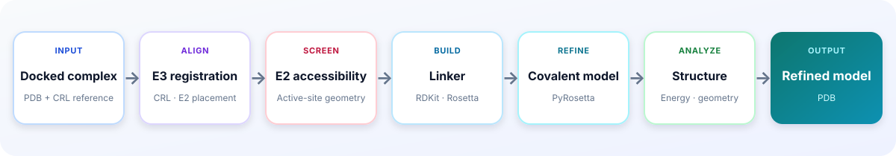

<div align="center">

# OligoTernary

**A Computational Workflow for Modeling Oligo-PROTAC Ternary Complexes**

<p>
  
  
  
  
</p>

[Workflow](#modeling-workflow) · [Installation](#installation) · [Example](#example) · [Charges](#resp-charge-fitting) · [Simulation](#amber-simulation) · [CLI](#command-line-interface)

</div>

OligoTernary is a computational workflow for modeling Oligo-PROTAC ternary
complexes through CRL/E2 geometric screening, linker reconstruction,
structural refinement, and molecular dynamics. A ready-to-run miRNA-PROTAC
example is included.

## Features

- CRL/E2 geometric screening and candidate-lysine assessment;
- explicit linker reconstruction, covalent refinement, and structural evaluation;
- RESP charge fitting and Amber molecular dynamics for the miRNA-PROTAC example.

## Modeling workflow

<p align="center">
  
</p>

## Requirements

Rosetta and PyRosetta must be installed separately from an authorized
[RosettaCommons distribution](https://rosettacommons.org/software/download/).

The complete example has been tested with Python 3.10 and PyRosetta
2025.22+release.957f89124e. Confirm that PyRosetta imports in the active
environment:

```bash
python -c "import pyrosetta; print(pyrosetta.version())"
```

The workflow uses Rosetta's
`main/source/scripts/python/public/molfile_to_params.py` utility. Set the
Rosetta installation root before running:

```bash
export ROSETTA_ROOT=/path/to/rosetta
```

Amber simulations require a separately installed Amber engine such as
`pmemd.cuda` on `PATH`.

## Installation

```bash
cd oligoternary
conda env create -f environment.yml
conda activate oligoternary
python -m pip install -e .
oligoternary-preflight
```

## Example

```bash
oligoternary validate examples/mirna/modeling.yaml
oligoternary run examples/mirna/modeling.yaml --dry-run
oligoternary run examples/mirna/modeling.yaml
```

Generated files are written under `runs/`, which is excluded from Git.

See
[examples/mirna/README.md](examples/mirna/README.md) for the chain map and
input layout.

## RESP charge fitting

The bundled three-conformer ESP data reproduce the charge model used to build
the example Amber topology:

```bash
oligoternary-charge validate examples/mirna/charges.yaml
oligoternary-charge fit examples/mirna/charges.yaml
```

Fitted charges are written to `runs/mirna-resp/charges.csv`.

## Amber simulation

The example Amber inputs are already solvated and parameterized. They are
compressed in Git and unpacked automatically:

```bash
oligoternary-simulate validate examples/mirna/simulation.yaml
oligoternary-simulate run examples/mirna/simulation.yaml --dry-run
oligoternary-simulate run examples/mirna/simulation.yaml
```

## Input requirements

A custom run starts from one docked or assembled PDB containing four distinct
chains:

| Component | Example chain |
| --- | --- |
| protein of interest | `A` |
| oligonucleotide warhead | `B` |
| E3 ligase | `C` |
| bound E3-ligand fragment | `X` |

The linker chain (for example `L`) is created by OligoTernary. The run
specification also supplies a two-ended linker SMILES, a one-ended E3-ligand
SMILES, and the two attachment atoms as `chain:residue:atom` labels.

The E2-accessibility stage additionally requires a CRL/E2 reference complex
for the recruited E3 system. Its configuration identifies the matching E3
chains, the E2 chain and active-site cysteine, and the steric and Lys–Cys
distance thresholds. The E3 alignment residue count and RMSD limits must also
be appropriate for the selected reference.

A new charge fit requires atom mapping, constraints, conformer geometries, and
matching QM ESP grids. The included `charges.yaml` demonstrates the accepted
input format; the Amber topology supplied here already contains those fitted
charges.

To adapt the example, copy its directory and change the project name, output
paths, PDB, SMILES, chain IDs, and anchor labels as one consistent set. Keep
the copy at the same directory depth so that its relative paths remain valid:

```bash
cp -R examples/mirna examples/my-system
oligoternary validate examples/my-system/modeling.yaml
oligoternary run examples/my-system/modeling.yaml
```

## Command-line interface

| Command | Purpose |
| --- | --- |
| `oligoternary` | validate, dry-run, or run a workflow |
| `oligoternary-preflight` | locate and check `molfile_to_params.py` |
| `oligoternary-e2-accessibility-screen` | screen E2 active-site accessibility |
| `oligoternary-refine` | run linker reconstruction directly |
| `oligoternary-metrics` | calculate structural metrics directly |
| `oligoternary-charge` | validate or fit multi-conformer RESP charges |
| `oligoternary-simulate` | validate or run sequential Amber MD stages |

Every command provides `--help`.

## Repository layout

```text
oligoternary/
├── src/oligoternary/
│   ├── workflow/              # configuration, execution, and provenance
│   ├── modeling/              # linker construction and PyRosetta refinement
│   ├── analysis/              # E2 accessibility and structural metrics
│   ├── simulation/            # RESP fitting and Amber MD execution
│   └── cli/                   # installed commands
├── examples/mirna/            # modeling, RESP, and Amber MD examples
├── docs/                      # modeling and configuration guides
├── environment.yml
└── pyproject.toml
```

## Documentation

- [Modeling tutorial](docs/MODELING_TUTORIAL.md)
- [Amber simulation tutorial](docs/SIMULATION_TUTORIAL.md)
- [Modeling configuration](docs/MODELING_CONFIG.md)
- [Third-party software notices](THIRD_PARTY_NOTICES.md)

## License

OligoTernary is released under the [MIT License](LICENSE). Rosetta, PyRosetta,
Amber, and other separately installed dependencies retain their own license
terms.
